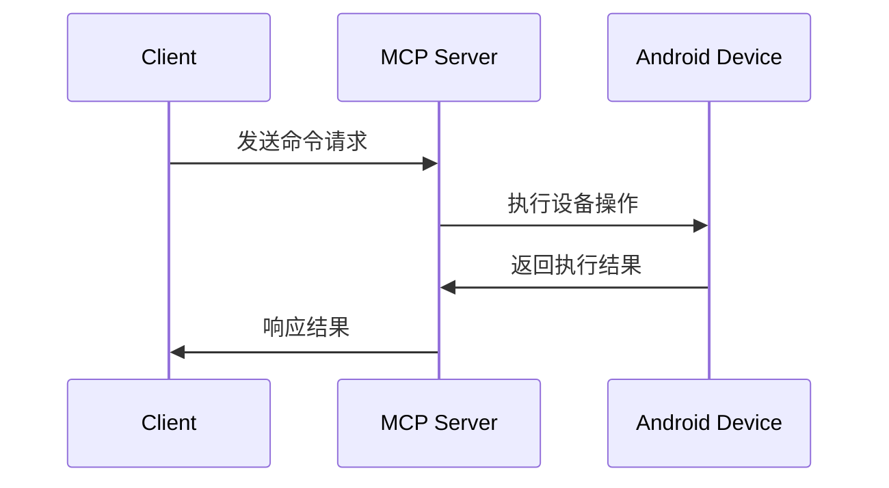
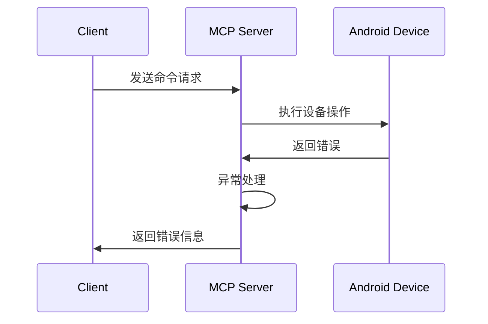

# 用户流程与项目结构

## 项目结构

```
uiautomator2-mcp/
├── project_docs/           # 项目文档
├── src/                    # 源代码
│   ├── mcp_android/       # MCP Android模块
│   │   ├── __init__.py
│   │   ├── android.py     # Android设备管理
│   │   ├── app.py        # 应用管理
│   │   └── ui.py         # UI操作
│   └── server.py         # MCP服务器入口
├── tests/                 # 测试用例
│   ├── __init__.py
│   ├── test_android.py
│   ├── test_app.py
│   └── test_ui.py
├── examples/              # 使用示例
├── pyproject.toml        # 项目配置
├── README.md             # 项目说明
└── requirements.txt      # 依赖清单
```

## 用户流程

### 1. 开发者使用流程

1. 环境准备
   - 安装Python环境
   - 安装ADB工具
   - 准备Android设备

2. 安装配置
   - 安装依赖包
   - 配置环境变量
   - 连接设备

3. 启动服务
   - 运行MCP服务器
   - 验证设备连接
   - 测试基本功能

4. 开发集成
   - 调用MCP接口
   - 处理返回结果
   - 实现业务逻辑

### 2. AI助手使用流程

1. 连接设备
   - 检查设备状态
   - 初始化UIAutomator2
   - 建立设备连接

2. 应用控制
   - 启动目标应用
   - 执行UI操作
   - 获取操作结果

3. 状态监控
   - 获取屏幕状态
   - 检查操作结果
   - 处理异常情况

4. 任务完成
   - 清理环境
   - 关闭应用
   - 断开连接

## 数据流程

### 1. 命令执行流程


### 2. 异常处理流程


## 接口说明

### 1. MCP工具接口
- 设备管理接口
- 应用管理接口
- UI操作接口
- 系统控制接口

### 2. 资源接口
- 设备信息资源
- 应用列表资源
- 屏幕截图资源
- 状态信息资源 